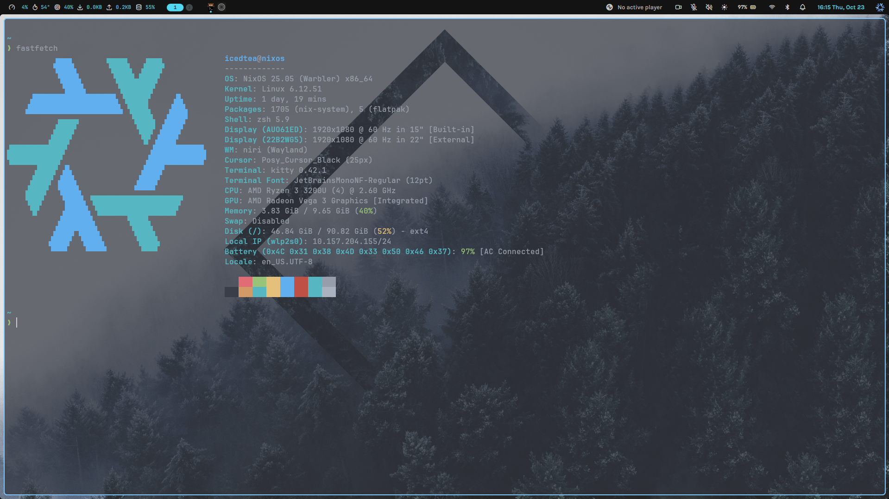

# icedcoffeeee's nixos



## main stack
- [niri compositor](https://github.com/YaLTeR/niri)
- [noctalia quickshell](https://github.com/noctalia-dev/noctalia-shell)

## steal my config
1. flash the minimal version of nixos (no desktop).
1. login and run:
    ```sh
    curl https://raw.githubusercontent.com/icedcoffeeee/nixos/refs/head/main/install.sh | bash
    ```
1. when vim opens, change your user and hostname.
